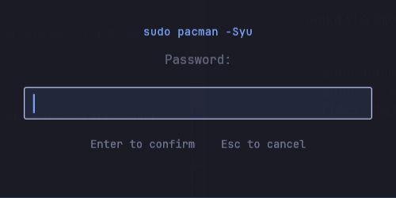

# sudo-pop

**English** · [한국어](README.ko.md)

One password prompt for everything privileged on Omarchy — `sudo`, `run0`, disk
mounts, NetworkManager, systemctl — in a window built so the password never
reaches a core dump, swap, a screen share, or a log.

It is a **polkit authentication agent** with a **sudo router** in front of it, so
every path ends at the same window:

```
sudo pacman -Syu   →  run0 pacman -Syu   ─┐
sudo -E make       →  sudo -A -E make    ─┤→  one window
disk mounts · NetworkManager · systemctl ─┘
```

<p align="center">
  
</p>

Option-free commands route to `run0`; anything with an option or a `VAR=value`
stays on `sudo` with `-A` added for our window (the original options are kept);
and the bottom row are native polkit actions, which reach the window once sudo-pop
holds the agent seat. Whichever path, the top line of the window is the real
command behind the request — it tells you **which command is asking**, where
polkit's own generic wording does not.

---

## How it differs from the shell's own agent

Omarchy ships its own polkit agent, `omarchy.polkit` — a QML service that runs
inside the shell process. Replacing it is a real choice, so here is what changes —
all of it measured on this machine, not asserted:

| | sudo-pop | omarchy.polkit |
|---|---|---|
| Password hardening — no core dump, no swap, locked in RAM, wiped | ✓ | ✗ — the password lives in the long-lived shell process |
| Excluded from screen sharing and recording | ✓ | ✗ — a layer surface can't carry the rule |
| Shows the **actual command** that is asking | ✓ `pacman -Syu` | a random unit name (`run-p1592…service`) |
| Refuses callers that aren't polkit | ✓ | ✗ — neither reference agent checks |
| Attempts-left warning · refuses a locked account | ✓ | ✗ |
| `sudo` and polkit prompts in one window | ✓ | sudo untouched |
| Theme colors, matched to the system dialog | ✓ | ✓ |
| Fingerprint | ✗ | ✓ |

Two of these — refusing non-polkit callers, and naming the command behind a
`run0` request — are things neither the shell's agent nor hyprpolkitagent does.

---

## Where the password goes, and where it can't

Every request is handled by a short-lived child that hardens itself before the
password can reach memory:

- a crash writes **no core dump** — the password never lands on disk
- the buffer is **locked into RAM**, so it can't reach swap or a hibernation image
- the window is **excluded from screen sharing** and recording
- the password appears in **no log, no command line, and no environment variable**
- only **polkit** may ask the window to draw; anything else on the bus is refused
  before a window appears

The boundary, plainly: this is a convenience tool, not a security wall. Malware
already running as you can swap the alias or the binary. What it defends against
is **careless leakage** — and, as the table shows, it defends it in places the
shell's own agent can't reach.

---

## Requirements

| | |
|---|---|
| Omarchy | 4.0+ — the shell's own polkit agent steps aside (below) |
| Hyprland | 0.56+, Lua config. The window rules assume it |
| systemd | 256+ for `run0`. Verified on 261 |
| Rust | to build. With `mise`, `mise.toml` pins the toolchain |

---

## Install

```bash
curl -fsSL https://raw.githubusercontent.com/minsoft1115/sudo-pop/main/install.sh | bash
```

That builds it, puts the binary in `~/.local/bin`, and runs `sudo-pop --init`.
Everything it writes lives under `$HOME`, so **do not run it as root** — it
refuses if you try.

`--init` installs four things, all inside markers so they come back out exactly:
the `sudo` alias, the Hyprland window rules, the require line in `hyprland.lua`,
and a systemd user unit for the agent.

### Handing the seat over from Omarchy

polkit allows one agent per session, and the Omarchy shell holds the seat by
default. While it does, `--init` installs the unit but **leaves it disabled** and
says so. To switch:

```bash
omarchy plugin disable omarchy.polkit
sudo-pop --init
```

You gain the hardening, the screen-share exclusion, and the command line of
whatever is asking; the theme colors carry over, since sudo-pop reads the shell's
own `[polkit]` palette. You give up its fingerprint path. `--init` tells you which
agent holds the seat whenever you run it.

## Uninstall

```bash
curl -fsSL https://raw.githubusercontent.com/minsoft1115/sudo-pop/main/install.sh | bash -s -- --uninstall
omarchy plugin enable omarchy.polkit
```

---

## Good to know

A few things that follow from being a polkit agent rather than a plain askpass:

- **Plain commands go through `run0`.** `sudo pacman -Syu` runs as a systemd unit
  authenticated by polkit — which is exactly what lets the agent draw the window.
  On that path `sudoers` rules don't apply (no `NOPASSWD`, no `env_keep`, so no
  `SSH_AUTH_SOCK` or `DISPLAY`), and the auth is cached by polkit rather than sudo.
  Anything with an option or a `VAR=value` keeps sudo's meaning instead.
  `SUDO_POP_RUN0=0` turns the routing off.
- **On the run0 path, answer within 25 seconds** — the caller's D-Bus timeout, not
  ours. The window says as much; the sudo path has no such limit.
- **polkit and sudo share one faillock counter**, so a wrong password here counts
  against both. The window shows how many attempts remain before a lock.
- **`/usr/bin/sudo` always reaches the real sudo.** `\sudo` doesn't — it suppresses
  the alias but not the shell function another tool in this config installs.

---

## Documentation

| | |
|---|---|
| [docs/plan.md](docs/plan.md) | what it is and what the implementation must hold to |
| [docs/rationale.md](docs/rationale.md) | why, what was measured, what was rejected |
| [docs/audit.md](docs/audit.md) | a full review of the current code and what it fixed |
| `old/` | the previous implementation — a sudo askpass wrapper — kept whole, with its own docs |

The design docs are written in Korean.

## Development

```bash
cargo test                            # unit and protocol tests, no environment needed
./tests/scenarios.sh                  # needs polkitd, the bus, and a compositor
./tests/scenarios.sh --with-password  # opens a foot window for the one case that needs typing
```

The scenario suite puts the session back the way it found it, prints what it
restored, and clears the faillock entries it burned.

## License

MIT
