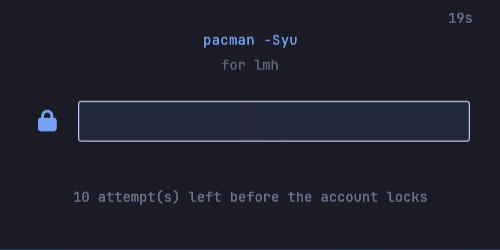

# sudo-pop

**English** · [한국어](README.ko.md)

One password prompt for everything privileged on Omarchy — `sudo`, `run0`, disk
mounts, NetworkManager, systemctl — in a window designed to reduce password exposure through memory, core dumps,
screen sharing, and logs.

It is a **polkit authentication agent** with a **sudo router** in front of it, so
every path ends at the same window:

```
sudo pacman -Syu   →  run0 pacman -Syu    ─┐
sudo -E make       →  sudo -A -E make    ─┤→  one window
disk mounts · NetworkManager · systemctl ─┘
```

<p align="center">
  
</p>

The installed terminal PATH wrapper forwards to sudo-pop: plain commands use run0
and polkit, while sudo-specific options retain the existing real-sudo fallback.
Agents and child scripts inherit that PATH. The polkit agent provides fingerprint
and password UI. On the real-sudo path, sudo's PAM tries fingerprints before
askpass, so that path may wait at the sensor without a window.
The window shows the requesting command when it can be determined.

---

## How it differs from the shell's own agent

Omarchy ships its own polkit agent, `omarchy.polkit` — a QML service that runs
inside the shell process. Replacing it is a real choice, so here is what changes —
all of it measured on this machine, not asserted:

| | sudo-pop | omarchy.polkit |
|---|---|---|
| Password hardening — dump prevention, RAM locking, buffer wiping | ✓ | ✗ — the password lives in the long-lived shell process |
| Excluded from screen sharing and recording | ✓ | ✗ — a layer surface can't carry the rule |
| Shows the **actual command** that is asking | ✓ `pacman -Syu` | a random unit name (`run-p1592…service`) |
| …and what a desktop request will do | ✓ `mount the filesystem` | ✓ |
| Refuses callers that aren't polkit | ✓ | ✗ — neither reference agent checks |
| Shows the shared lockout budget at all times · blocks passwords while locked | ✓ | ✗ |
| Counts down the caller's 25-second deadline | ✓ | ✗ |
| `sudo` and polkit prompts in one window | ✓ | sudo untouched |
| Theme colors, matched to the system dialog | ✓ | ✓ |
| Fingerprint | ✓ PAM passthrough + wait icon | ✓ |

Two of these — refusing non-polkit callers, and naming the command behind a
`run0` request — are things neither the shell's agent nor hyprpolkitagent does.

---

## Where the password goes, and where it can't

Every request is handled by a short-lived child that hardens itself before the
password can reach memory:

- core dumps and ordinary same-user debugger access are disabled when hardening succeeds
- password buffers are **locked into RAM** when `mlock` succeeds and wiped after use
- hidden input reaches egui only as opaque markers and masking characters; undo/redo
  is disabled, and deleted bytes are wiped in the protected buffer
- the window is **excluded from screen sharing** and recording
- the password appears in **no log, no command line, and no environment variable**
- only **polkit** may ask the window to draw; anything else on the bus is refused
  before a window appears

Memory protection starts at the app's raw-input hook. OS, IME, clipboard and backend
copies made earlier are outside that boundary; RAM locking does not protect a
hibernation image. Hardening failures currently warn and continue. See
[the password-memory issue](issues/01-password-memory-copies.md) for validation and limits.

The boundary, plainly: this is a convenience tool, not a security wall. Malware
already running as you can swap the wrapper or the binary. What it defends against
is **careless leakage** — and, as the table shows, it defends it in places the
shell's own agent can't reach.

---

## Requirements

| | |
|---|---|
| Omarchy | 4.0+ — the shell's own polkit agent steps aside (below) |
| Hyprland | 0.56+, Lua config. The window rules assume it |
| systemd | 256+ for `run0`. Verified on 261 |
| Rust | to build. With `mise`, `mise.toml` pins the toolchain |

---

## Install

```bash
curl -fsSL https://raw.githubusercontent.com/minsoft1115/sudo-pop/main/install.sh | bash
```

That builds it, puts the binary in `~/.local/bin`, and runs `sudo-pop --init`.
Everything it writes lives under `$HOME`, so **do not run it as root** — it
refuses if you try.

`--init` installs the sudo PATH wrapper and shell snippet, the Hyprland window
rules and require block, and a systemd user unit for the agent. The old sudo-pop
alias snippet is replaced on upgrade; unrelated aliases/functions are preserved.

### Handing the seat over from Omarchy

polkit allows one agent per session, and the Omarchy shell holds the seat by
default. While it does, `--init` installs the unit but **leaves it disabled** and
says so. To switch:

```bash
omarchy plugin disable omarchy.polkit
sudo-pop --init
```

You gain the hardening, the screen-share exclusion, and the command line of
whatever is asking; the theme colors carry over, since sudo-pop reads the shell's
own `[polkit]` palette. Fingerprint wait uses the same PAM stack Omarchy set up —
the window shows a sensor icon until PAM asks for a password. `--init` tells you
which agent holds the seat whenever you run it.

## Uninstall

```bash
curl -fsSL https://raw.githubusercontent.com/minsoft1115/sudo-pop/main/install.sh | bash -s -- --uninstall
omarchy plugin enable omarchy.polkit
```

---

## Good to know

A few things that follow from being a polkit agent rather than a plain askpass:

- **The installed `sudo` wrapper preserves sudo-pop routing.** Plain commands use
  run0 and polkit policy, not sudoers. Sudo-specific options retain the existing
  real-sudo path; explicit `-A`, `-n` and `-S` are passed through. The wrapper
  does not override the caller's `SUDO_POP_RUN0` preference.
- **On the run0 path, answer within 25 seconds** — the caller's D-Bus timeout, not
  ours. The window counts it down in the corner, in the error colour for the last
  five seconds. The sudo path has no limit, so nothing counts down there.
- **polkit and sudo share one faillock counter**, so a wrong password here counts
  against both. The window says how many are left the whole time it is open,
  in the error colour once three or fewer remain. That holds where the PAM
  stack being answered runs `pam_faillock`; Omarchy's fingerprint setup writes
  an `/etc/pam.d/polkit-1` without it, and there polkit passwords neither count
  nor lock, so the window shows no number.
- **A password lock still allows PAM to try a configured fingerprint** when the lid is open.
  If PAM then asks for input while the account is locked, no answer is sent; the window
  shows the lock reason for up to five seconds (Esc closes it sooner). Without a fingerprint
  opportunity, only the notice appears. On the askpass path, sudo tries the fingerprint
  before opening our window. This does not clear faillock or change PAM policy.
- **`/usr/bin/sudo` always reaches the real sudo.** `\sudo` doesn't — it suppresses
  aliases but not the PATH wrapper or shell functions.

---

## Documentation

| | |
|---|---|
| [docs/plan.md](docs/plan.md) | what it is and what the implementation must hold to |
| [docs/fingerprint.md](docs/fingerprint.md) | fingerprint: PAM passthrough and the wait UI |
| [docs/rationale.md](docs/rationale.md) | why, what was measured, what was rejected |
| [docs/audit.md](docs/audit.md) | a full review of the current code and what it fixed |
| `old/` | the previous implementation — a sudo askpass wrapper — kept whole, with its own docs |

The design docs are written in Korean.

## Development

```bash
cargo test                            # unit and protocol tests, no environment needed
./tests/scenarios.sh                  # needs polkitd, the bus, and a compositor
./tests/scenarios.sh --with-password  # opens a foot window for the one case that needs typing
./tests/scenarios.sh --restart-polkitd  # restarts polkitd and checks the agent follows it
```

The scenario suite puts the session back the way it found it, prints what it
restored, and clears the faillock entries it burned.

## License

MIT

## Terminal PATH installation (0.2.1-spike)

`--init` installs `~/.local/lib/sudo-pop/bin/sudo` and replaces the old alias
snippet with a PATH snippet loaded from the shell rc. The wrapper uses the installed
binary's absolute path (including custom `--prefix`) and preserves its routing.
Open a new terminal or source `~/.bashrc`, then restart agents from that terminal.
Child scripts inherit the wrapper without needing interactive alias expansion.
Other sudo aliases/functions are left alone. Desktop launchers and separate services
are not reconfigured. Both the snippet and wrapper are removed by `--uninit`.

sudo's PAM tries fingerprints before it calls askpass, so the sudo path may wait
at the sensor before our password window appears. Native polkit/run0 requests still
use the registered agent, including its fingerprint UI.
